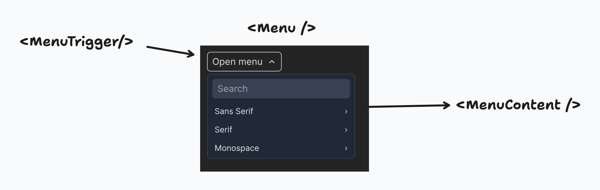
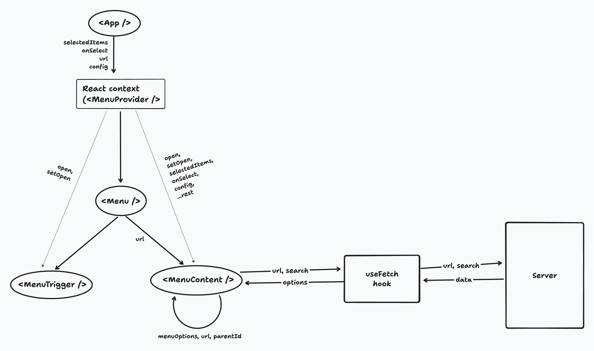

# Menu UI

### Setup

- To setup the client, we need to install the required packages using `npm i`
- Create an env file named `.env.local` and add `VITE_API_URL=<your_api_endpoint>` to the file.
- To start the dev server, run `npm run dev`

### Dependencies

- [Vite](https://vitejs.dev/): We're using Vite as our build tool and development server.
- [React](https://react.dev/): Frontend library for building user interfaces.
- [Tailwind CSS](https://tailwindcss.com/): Utility-first CSS framework for styling.
- [Lucide React](https://lucide.dev/): Icon library.
- [clsx](https://github.com/lukeed/clsx): Utility for constructing className strings.

### Components

- The menu components can be found in the `src/components/menu` folder.  
- `menu.tsx` is the component that is exposed to the user. It takes the following values as props.
    - `url` (required): The URL endpoint that is used to fetch the options asynchronously.
    - `config` (optional): This allows the user to configure certain behaviors like the search type, placeholder, and the keys used to fetch the text, children, commands, and disabled values from the option object.
    - `selectedItems` `(default = [])`: A list of options that are selected in the menu. We allow the user to pass this value so that we can persist the selected values even after the menu content is destroyed.
    - `onSelect(selectedItems: string[])`: A callback function that is used to update the `selectedItems` value.
- `menu-trigger.tsx` contains the Trigger component that is used to open or close the menu.
    - Users can either use it as `<Menu.Trigger />` from the menu file or import `MenuTrigger` from this file.
    - We allow the user to either use a styled trigger button or bring their own custom components as a trigger element.
- `menu-content.tsx` is an internal component that is used to recursively (if nested options are available) render the menu options.
- `context.ts` contains the top-level state for the menu component. This includes the `open` state, `setOpen` state action, and other values or callbacks provided as props to the `<Menu /> component.
- `hooks/useFetch.tsx` provides a hook that fetches the options data based on the url provided and caches the values based on the url. This hooks returns the data, a loading as well as an error state, along with the callback function to fetchData manually if required later.  

Here's how the data and app state flows through the components.

### Performance + UX/DX (and further improvements)

Here are some updates done to improve the performance and UX of the menu component.
- The options are cached based on the URL and search parameters to avoid redundant API calls. However, if the API is expected
to update options frequently we might have to switch to a stale-while-revalidate approach.
- We use the `useDebouncedValue` hook to prevent unnecessary API requests during search if the user prefers it.
- We use `useLayoutEffect` to compute and update the position of the menu before the browser repaints the screen to avoid glitches on the UI.
- We've memoized certain values and callbacks using React's `useMemo` and `useCallback` hooks to prevent unnecessary re-renders.
- The component supports both light and dark modes.
- The component a11y friendly, but does not support keyboard navigation using up/down/left/right arrows.
- The menu and submenu content is shown based on the available space in the viewport for smaller screens. Ideally, a better real-world solution is to move away from a menu component for mobile screens and use a sheet/drawer component instead.
- From a DX perspective, the menu component is designed to support some level of customizations like search content, type, custom trigger components, etc. But the menu content is not customizable as of now. We could allow users to bring their own UI components for the content/items and follow a completely headless architecture instead (time constraint 😢).